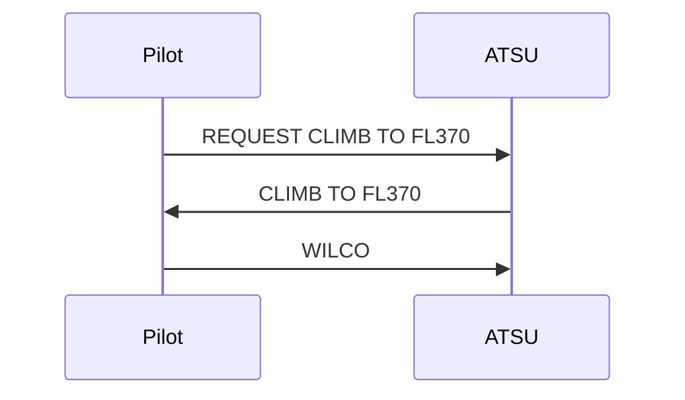
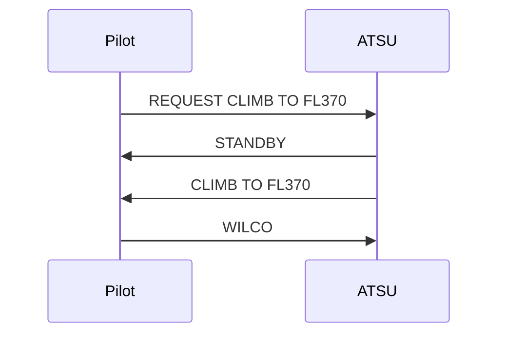
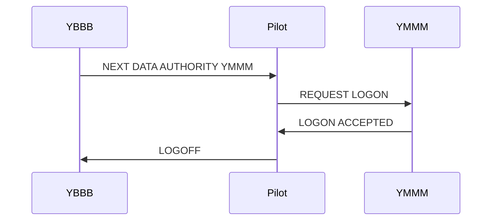

# CPDLC Overview

Controller-Pilot Data Link Communications (CPDLC) is a method of communication between air traffic controllers and pilots using data link rather than voice. This document provides an overview of CPDLC concepts relevant to controllers using the CPDLC Plugin on the VATSIM network.

## ATS Units and Aircraft

An Air Traffic Service Unit (ATSU) is a ground station connected to an ACARS network.
Aircraft connect to ATSUs via an intermediate network (such as ACARS) to exchange CPDLC messages with controllers.

## Uplink and Downlink Messages

CPDLC messages are categorised by their direction:

- **Uplink messages** are sent from the ground station to the aircraft (controller to pilot)
- **Downlink messages** are sent from the aircraft to the ground station (pilot to controller)

Uplink and downlink messages have different properties, particularly around response requirements.

## Message Composition

CPDLC messages are typically standardised templates with elements for the pilot or controller to populate.
For example, a climb clearance template might include a placeholder for the flight level.

Multiple messages can be joined together and sent as a single uplink.
This is useful when issuing related instructions together.

Free-text messages allow for manual text entry when no template from the message set is appropriate.

## Response Types

Each message template specifies a response type that determines how the recipient should respond.

### Uplink Message Response Types

| Response Type | Description |
|:-------------:|-------------|
| `WU` | Pilot responds with WILCO or UNABLE |
| `AN` | Pilot responds with AFFIRM or NEGATIVE |
| `R` | Pilot responds with ROGER |
| `NE` | No response expected |

### Downlink Message Response Types

| Response Type | Description |
|:-------------:|-------------|
| `Y` | ATC must respond to the message |
| `N` | ATC is not required to respond |

### Concatenated Message Response Types

When multiple uplink messages are joined together, the response type for the entire message is determined by priority:

1. `WU` (highest priority)
2. `AN`
3. `R`
4. `NE` (lowest priority)

For example:

| Message | Individual Response Type |
|:-------:|:------------------------:|
| `CLIMB TO FL370` | `WU` |
| `REPORT PASSING FL350` | `R` |
| **Concatenated Message** | **`WU`** |

Because `WU` has the highest priority, the pilot will be prompted to respond with WILCO or UNABLE for the entire concatenated message.

## Dialogues

Dialogues represent a conversation between aircraft and ground stations. A dialogue can be:

- A single message that is immediately closed; or
- A series of related messages linked through Message Reference Numbers (MRN)

### Dialogue State

- A dialogue is **open** if any message within it is open
- A dialogue is **closed** when all messages within it are closed

Messages that do not require a response (`NE` for uplinks, `N` for downlinks) are closed automatically.
Some messages are exempt from closing dialogues, such as `STANDBY` and `REQUEST DEFERRED`.

### Example: Climb Request

| Step | Message | Response Type | Uplink State | Downlink State | Dialogue State |
|:----:|---------|:-------------:|:------------:|:--------------:|:--------------:|
| 1 | Pilot: REQUEST CLIMB TO FL370 | `Y` | | Open | Open |
| 2 | ATC: CLIMB TO FL370 | `WU` | Open | Closed | Open |
| 3 | Pilot: WILCO | `N` | Closed | Closed | Closed |

### Example: Climb Request with STANDBY

| Step | Message | Response Type | Uplink State | Downlink State | Dialogue State |
|------|---------|:-------------:|:------------:|:--------------:|:--------------:|
| 1 | Pilot: REQUEST CLIMB TO FL370 | `Y` | | Open | Open |
| 2 | ATC: STANDBY | `NE` | | Open | Open |
| 3 | ATC: CLIMB TO FL370 | `WU` | Open | Closed | Open |
| 4 | Pilot: WILCO | `N` | Closed | Closed | Closed |

Note that STANDBY does not close the pilot's request.
The dialogue remains open until the controller issues a clearance and the pilot responds.

## Data Authority

Data authority determines which ground station is responsible for communicating with an aircraft.

### Current Data Authority

The Current Data Authority (CDA) is the ground station currently responsible for the flight. CPDLC dialogues between the pilot and controller take place through the CDA.

Aircraft may reject uplink messages from stations that are not their Current Data Authority.

### Next Data Authority

The Next Data Authority (NDA) is the ground station designated to take over communications. This typically occurs when an aircraft connects to the next ATSU preemptively before a handoff.

New connections from aircraft always start as Next Data Authority. An aircraft in NDA state is promoted to CDA upon receipt of the first downlink message.

The current ATSU will send a `NEXT DATA AUTHORITY` uplink message to the aircraft when transferring them to a new ATSU.
This will instruct the pilot to establish a connection with the next ATSU and terminate the connection with the current one.

## CPDLC on VATSIM

VATSIM does not have an official CPDLC solution, though one is in development. In the meantime, CPDLC for flight simulation networks typically uses Hoppie's ACARS network.

### Hoppie's ACARS Network

Hoppie's network does not prescribe a standard protocol or message format for CPDLC.
ATC client and aircraft addon developers must agree on message formats.
This can lead to incompatibilities between different implementations.

Stations connected to Hoppie's network poll for messages at regular intervals.
Messages are not received instantly by the recipient.
It may take up to one minute for a message to reach the pilot, and another minute for a response to return.

### Aggregation Server

Hoppie's network does not allow multiple controllers to use a single ATSU callsign. The aggregation server solves this problem by acting as a relay between controllers and the ACARS network, allowing multiple controllers to share a single ATSU connection.
