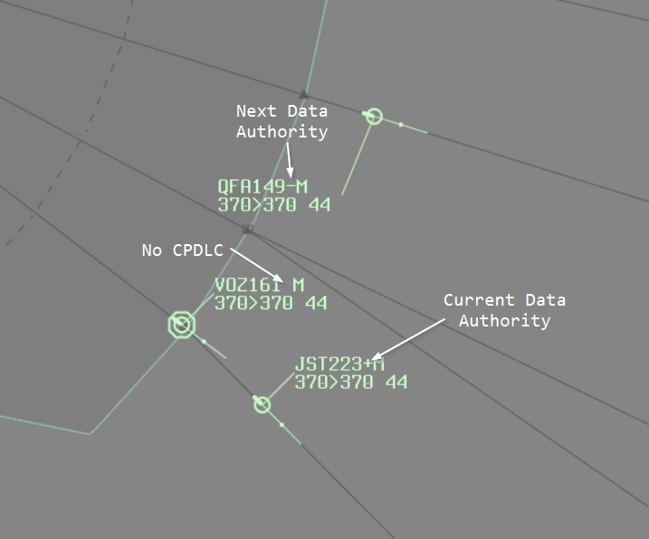
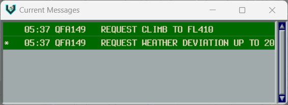
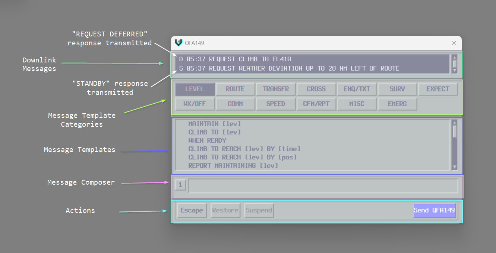
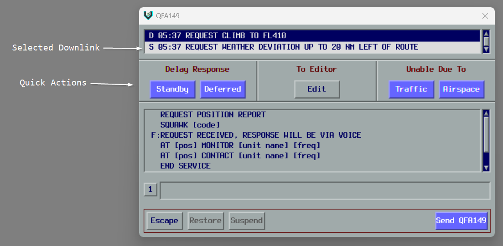
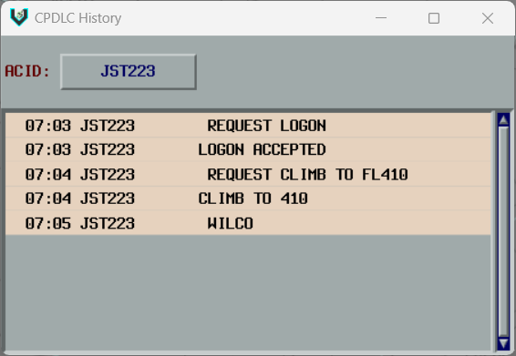
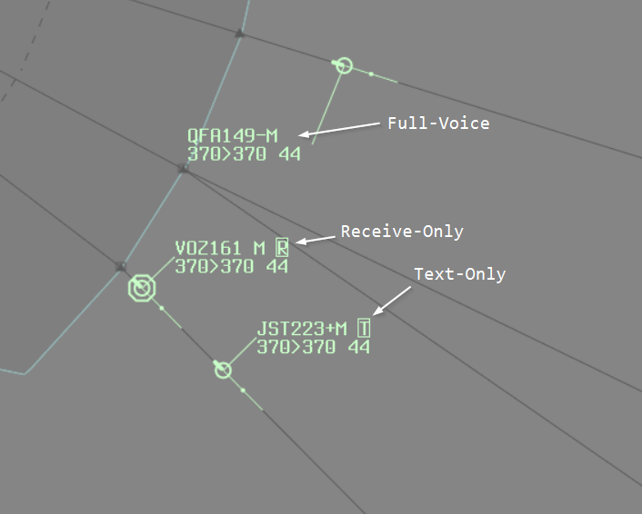

# Plugin Guide

This guide covers the CPDLC Plugin for vatSys.
It explains how to connect to the server, interpret track labels, and manage CPDLC messages with pilots.

## Connecting to the CPDLC Server

To connect, open the CPDLC menu and select Setup. Verify the server URL and station ID, then click Connect.

The station you select is your primary ATSU. Once connected, you can send and receive messages for any ATSU managed by that server. This allows controllers to extend their jurisdiction across FIR boundaries (e.g., Brisbane Centre extending to Melbourne Centre) when both ATSUs share a server.

## Track Label Item



The CPDLC track label item shows the connection status of each aircraft.

The connection status is denoted by the following symbols:

- (blank): Aircraft is not CPDLC capable
- `.`: Aircraft is connected to the ACARS network and available for logon
- `-`: Aircraft has logged on, we are the Next Data Authority
- `+`: Aircraft has logged on, we are the Current Data Authority

The background of the item will change when a downlink message has been received and is awaiting response.
The colour of the symbol will change when an `UNABLE` response has been received.

Left-clicking the label item opens the CPDLC Editor.
If there are open downlink messages, the most recent one is automatically selected.

If the aircraft is not already logged on, left-clicking sends a `CONNECTION REQUESTED` message to initiate a controller-initiated logon.

## Current Messages Window



The Current Messages Window shows open CPDLC dialogues for aircraft in your jurisdiction.
It opens automatically when there are open dialogues and closes when all dialogues are resolved.

A dialogue is considered within your jurisdiction if any of the following conditions are met:

- You are currently tracking the aircraft
- You have sent at least one uplink message in the dialogue
- The aircraft is not tracked by anyone and is in an Announced state
- You were the last owner and the aircraft is no longer tracked by anyone

### Reading Messages

Messages are colour-coded to indicate their state. The specific colours may vary between vatSys profiles. Refer to local procedures for your specific colour coding.

Unacknowledged messages appear with inverted colours. Left-click a message to acknowledge it (mark as read).

**Message indicators:**

- `*`: Message is truncated. Right-click to expand.
- `P`: Message contains free-text.
- `!`: Message is urgent.

Once a dialogue is closed and acknowledged, all messages within the dialogue are moved to the [History Window](#history-window).

### Responding to Messages

Left-click the callsign to open the action menu. The available options depend on the message state.

For downlink messages (pilot requests), each menu item sends the corresponding uplink response to the pilot.
For example, selecting `STANDBY` sends the `STANDBY` message.

Additional actions:

- `MANUAL ACK`: Closes the message without a pilot response
- `RE-ISSUE`: Re-transmits a failed message
- `HISTORY`: Moves the dialogue to history

:::tip[Message ordering]
Messages are grouped by dialogue, not strictly by time. This means messages from different dialogues may appear out of chronological order, even though they are correctly ordered within each dialogue.

```
01:30: QFA1     REQUEST CLIMB TO FL370
01:31: QFA1     STANDBY
01:35: QFA1     CLIMB TO FL370
01:36: QFA1     WILCO
01:32: VOZ2     REQUEST WEATHER DEVIATION UP TO 20 NM LEFT OF ROUTE
01:33: VOZ2     CLEARED TO DEVIATE UP TO 20 NM LEFT OF ROUTE
01:33: VOZ2     WILCO
```
:::

## Editor Window

The Editor Window is used to compose uplink messages and respond to downlink requests from pilots. The window operates in two different modes depending on whether you are composing a new message or responding to a pilot request.



### Window Layout

The editor window is divided into several sections:

- **Downlink Messages Area**: Displays any received downlink messages from the pilot that require a response
- **Category or Quick Actions Panel**: Shows message category buttons or quick-action response buttons depending on context
- **Message Templates Area**: Lists available message templates from the selected category
- **Message Construction Area**: Where uplink messages are constructed
- **Action Buttons**: Provides Escape, Suspend, Restore, and Send buttons

### Downlink Messages Area

This area shows any received downlink messages from the pilot that are awaiting a response. The most recent downlink message is selected automatically when the window opens.

**Interacting with downlink messages:**
- Left-click a message to select it (which displays quick action buttons) or click again to deselect it (which shows message categories)
- Right-click a message to expand it if it has been truncated

### Message Categories

When no downlink is selected, message category buttons are displayed in a grid. Click a category button to view the message templates available in that category.

When no category is selected, the editor displays frequently used messages that are always available for quick access.

### Quick Actions



When a downlink message is selected, quick-action buttons are displayed instead of message categories. These buttons are organized into three sections:

**Delay Response:**
- **Standby**: Sends a STANDBY message to acknowledge the request while you coordinate
- **Deferred**: Sends a REQUEST DEFERRED message to defer the pilot's request

**To Editor:**
- **Edit**: Dismisses the quick actions and displays message categories so you can compose a custom response

**Unable Due To:**
- **Traffic**: Sends UNABLE DUE TO TRAFFIC in response to the request
- **Airspace**: Sends UNABLE DUE TO AIRSPACE RESTRICTION in response to the request

### Building Uplink Messages

To build an uplink message, click a message template in the message templates area. The template will be added to the message construction area.

If you have a message element selected in the construction area, clicking a template will replace that element. Otherwise, the template will be appended to the end of the list. You can combine up to 5 message elements in a single uplink.

Message templates may contain editable parameters enclosed in brackets (for example, `[level]` or `[freq]`). Some templates have default values that are pre-filled for common scenarios.

**Working with message elements:**
- **Left-click the line number**: Select or deselect that message element
- **Right-click the line number**: Insert a new blank element above the clicked element
- **Middle-click the line number**: Clear the element's content, or remove it entirely if it's already blank

**Editing template parameters:**
- Left-click a parameter (such as `[level]`) to begin editing it
- Middle-click a parameter to clear its value
- Press Enter to save your changes, or Escape to cancel editing

When the uplink is sent, multiple message elements are automatically joined together with `. ` as a separator.

### Action Buttons

**Escape**: Clears all message elements from the message construction area.

**Suspend**: Saves the current message for later use. You can only have one suspended message per aircraft at a time. You cannot suspend messages when quick actions are displayed or when responding to a downlink.

**Restore**: Loads a previously suspended message back into the message construction area.

**Send**: Transmits the uplink message to the aircraft. If you are responding to a downlink message, the dialogue will be closed. The editor window will close automatically if there are no remaining downlinks that require a response.

## History Window



The History Window shows previously completed dialogues. Use it to review past conversations with an aircraft.

Enter a callsign in the ACID input to display that aircraft's message history. Only one aircraft can be viewed at a time.

Messages are displayed the same way as in the Current Messages Window. Messages prefixed with `M` were manually acknowledged by the controller.

## Voice Capability Indicators



vatSys uses the real-world CPDLC track label symbols (`.`, `-`, `+`) to indicate voice capabilities.
With this plugin introducing CPDLC functionality, those symbols are now used for their intended purpose.
The plugin provides a replacement label item for voice capability to avoid confusion.

The replacement label shows the aircraft's voice capability:

- (blank): Aircraft is fully voice-capable
- `R`: Aircraft is receive-only
- `T`: Aircraft is text-only
- `V`: Aircraft is voice-capable (only displayed when a text message has been received)

The background colour will change to indicate that a text message has been received.

Left-clicking on the label item will open the text message editor.

## Automatic Actions

The plugin handles certain actions automatically without controller input.

**Logon:** Pilot logon requests are automatically accepted by the server.

**Next Data Authority:** Automatically calculates next data authority from aircraft route and online ATC. Transmits `NEXT DATA AUTHORITY` uplink prior to airspace entry. Errors display in vatSys error window if CPDLC logon code conflicts occur or cannot be found.

## Connection Termination

When handing off an aircraft or ending CPDLC service, controllers must manually send `END SERVICE` messages using the CPDLC editor.

### END SERVICE Behavior

The `END SERVICE` uplink terminates the CPDLC connection after the dialogue closes:

- **Standalone END SERVICE:** Connection terminates immediately since the message requires no response
- **With frequency instructions:** Connection remains active until the pilot responds (e.g., "END SERVICE. CONTACT MELBOURNE ON 123.45" or "END SERVICE. MONITOR SYDNEY ON 118.60" waits for WILCO before terminating)

This ensures pilots can acknowledge frequency change instructions before losing CPDLC connectivity. The aircraft will disappear from the Current Messages window once the connection terminates.

## Limitations

The plugin does not fully simulate all aspects of real-world CPDLC.

**ADS-C:** ADS-C position reporting is not simulated due to limitations within the vatSys plugin API.

**Equipment codes:** Aircraft equipment codes are ignored. The `.` symbol indicates the aircraft is connected to an ACARS network, regardless of their filed equipment.

## Troubleshooting

### Dialogues are not closing

This usually happens when you send a response without having the original downlink message selected. The response starts a new dialogue instead of closing the existing one.

Use `MANUAL ACK` on the original downlink message to close it.
